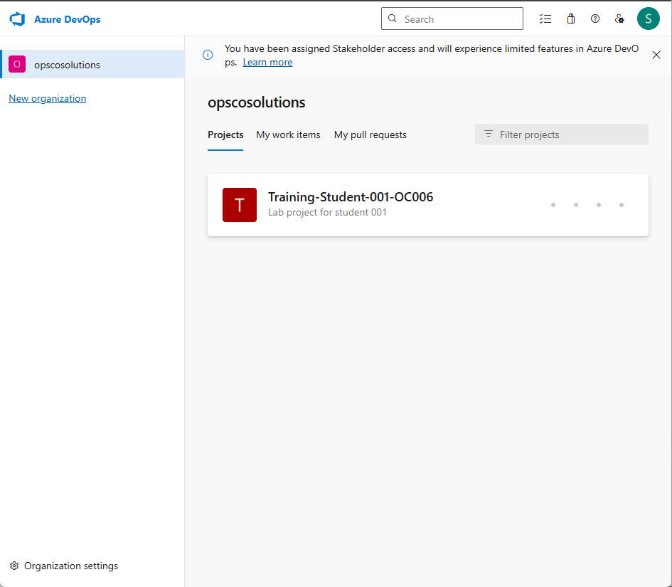

# Becoming familiar with Github & connection to Azure Portal and Azure Devops

## Activity 1: First connection to Microsoft Azure

### Objectives
In this lab, you will connect for the first time to Azure platform and to Azure DevOps platform using the credentials provided by the instructor.
  
  > **Note**: Microsoft Azure is a cloud computing platform that offers a wide range of services, including computing, storage, networking, and analytics, to help organizations build, manage, and deploy applications and services. 

  > **Note**: Microsoft Azure DevOps is a cloud-based platform that provides tools and services for software development teams to plan, collaborate, build, test, and deploy applications.


### Step-by-Step Instructions

1. Navigate to the Azure platform website: https://portal.azure.com/

1. Use the email and password provided to you by the instructor :

   Email: student0xx_OC0xx@opscosolutions.onmicrosoft.com
   
   Password: ***

1. Click **Next**.
   
    

1. Follow the instructions to **download the Microsoft Authenticator app on your personal phone**. Then click **Next** to setup the two-factor athentication (2FA).
   
    

1. Follow the instructions to add an Account and approve notifications, until you finish the setup with this screen.
   
    

1. Click ...

1. On the "Stay signed in?" page, tick "Don't show this again" then click **Yes**


  > **Note**: You have now access to your resource groups in the Azure cloud platform.


---

## Activity 2: First connection to Microsoft Azure DevOps

### Step-by-Step Instructions

1. Navigate to the Azure DevOps platform website: https://dev.azure.com/opscosolutions

1. Use the email and password provided to you by the instructor :

   Email: student0xx_OC0xx@opscosolutions.onmicrosoft.com
   
   Password: ***

1. Click **Next**.

1. On the "Stay signed in?" page, tick "Don't show this again" then click **Yes**

1. On the page "We need a few more details" keep the default and click **Continue**

  > **Note**: You have now access to your project in the Azure DevOps cloud platform.



---

## Activity 3: Creating and Managing a Repository on GitHub

### Step-by-Step Instructions

- Learn how to create a repository on GitHub
- Clone the repository locally
- Add a new file containing key Git commands
- Commit and push changes to the GitHub repository

### Step-by-Step Instructions

### 1. Create a Repository on GitHub

1. **Sign in to GitHub:**
   - Go to [GitHub](https://github.com/) and sign in to your account.

2. **Create a New Repository:**
   - Click on the `+` icon at the top right corner and select `New repository`.
   - Enter a repository name, e.g., `git-commands-tutorial`.
   - Optionally, add a description.
   - Choose the repository visibility (Public or Private).
   - Check `Initialize this repository with a README`.
   - Click on `Create repository`.

### 2. Clone the Repository Locally

1. **Open Terminal/Command Prompt:**
   - Open your terminal (macOS/Linux) or Command Prompt (Windows).

2. **Clone the Repository:**
   - Navigate to the directory where you want to clone the repository.
   - Run the following command:
     ```git
     git clone https://github.com/your-username/git-commands-tutorial.git
     ```

3. **Navigate to the Cloned Repository:**
   - Change to the directory of the cloned repository:
     ```git
     cd git-commands-tutorial
     ```

### 3. Add a New File Containing Key Git Commands

1. **Create a New File:**
   - Use a text editor to create a new file named `git-commands.md` in the repository directory.

2. **Add Key Git Commands:**
   - Open the `git-commands.md` file and add the following content:
     ```text
     # Key Git Commands

     ## Configuring Git

     git config --global user.name "Your Name"
     git config --global user.email "your.email@example.com"
  

     ## Initializing a Repository

     git init


     ## Cloning a Repository

     git clone https://github.com/your-username/repository.git


     ## Staging and Committing Changes

     git add filename
     git commit -m "Commit message"
 

     ## Viewing History
 
     git log
 

     ## Branching

     git branch new-branch
     git checkout new-branch


     ## Merging
  
     git merge branch-name


     ## Deleting Branches
 
     git branch -d branch-name


     ## Handling Merge Conflicts
 
     # Edit conflicted files
     git add resolved-file
     git commit
 

     ## Stashing
 
     git stash
     git stash pop


     ## Rebasing
 
     git rebase branch-name


     ## Cherry-Picking

     git cherry-pick commit-hash
 
     ```

### 4. Commit and Push Changes to GitHub

1. **Stage the New File:**
   - Run the following command to stage the `git-commands.md` file:
     ```git
     git add git-commands.md
     ```

2. **Commit the Changes:**
   - Run the following command to commit the changes:
     ```git
     git commit -m "Add git-commands.md with key Git commands"
     ```

3. **Push the Changes to GitHub:**
   - Run the following command to push the changes to the GitHub repository:
     ```git
     git push origin main
     ```
