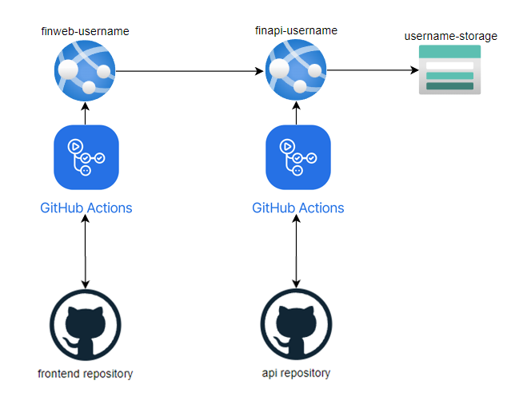
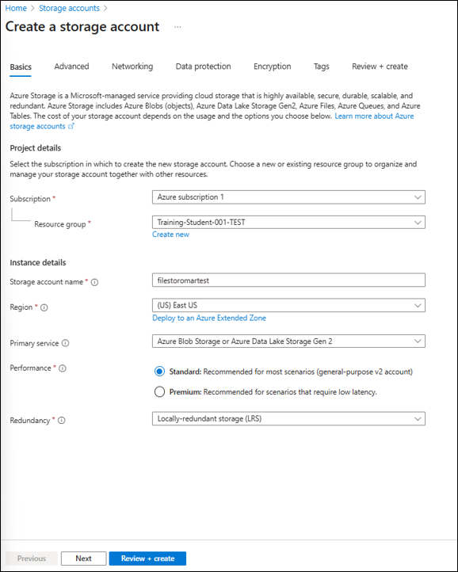
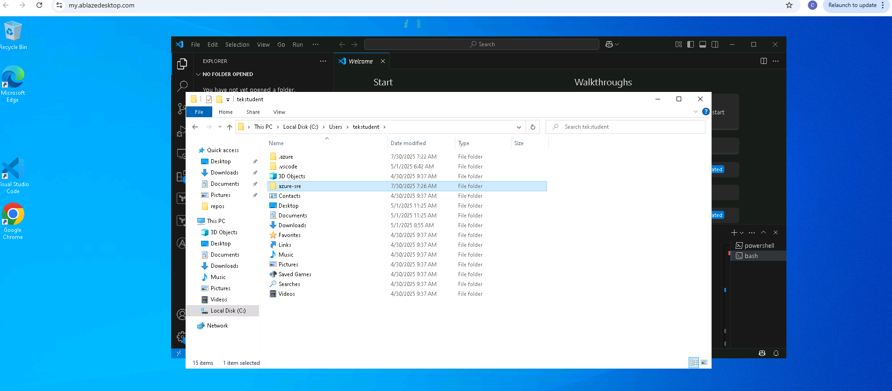

# Lab 02 - Build a web application on Azure

## Lab introduction

In this lab, you create a Storage Account, a Flask Web App, an API, and a simple deployment pipeline using GitHub Actions in Azure.

This lab requires an Azure subscription. Your subscription type may affect the availability of features in this lab. You may change the region, but the steps are written using **East US**.

## Estimated timing: 50 minutes

## Lab Scenario

In this lab, you will explore how to create a web application and blob storage on Azure by using the PaaS model. After the web application is created, you will learn how to upload existing web application files by using the Apache Kudu zip deployment option. You will then view and test the newly deployed web application.

## Job skills

+ Task 1: Create a Storage Account and Blob Containers
+ Task 2: Deploy a webapp using Azure Web Server
+ Task 3: Deploy an API using Azure Web Server 
+ Task 4: Implement GitHub Action using Azure Deployment Configuration


## Azure Web Application Architecture Diagram



## Instructions

### Before you start

#### Sign in to the lab environment.

1. Sign in to your Windows 11 virtual machine (VM).
[Link to the credentials](https://github.com/jruels/azure-sre/blob/main/VMs.md)

> **Note**: Your instructor will provide instructions to connect to the virtual lab environment.


### Exercise 1: Build a backend API by using Azure Storage and the Web Apps feature of Azure App Service

#### Task 1: Open the Azure portal

1. On the taskbar, select the **Microsoft Edge** icon.

1. In the browser window, browse to the Azure portal at `https://portal.azure.com`, and then sign in with the account you'll be using for this lab.

   > **Note**: If this is your first time signing in to the Azure portal, you'll be offered a tour of the portal. If you prefer to skip the tour, select **Maybe later** to begin using the portal.

#### Task 2: Create a Storage account

1. In the Azure portal, use the **Search resources, services, and docs** text box to search for **Storage Accounts**, and then in the list of results, select **Storage Accounts**.

1. On the **Storage accounts** blade, select **+ Create**.

1. On the **Create a storage account** blade, on the **Basics** tab, perform the following actions, and then select **Review + create**:

    | Setting | Action |
    |--|--|
    | **Subscription** drop-down list | Retain the default value -  |
    | **Resource group** section | Select **Training-Student-0xx-OC0xx** |
    | **Storage account name** text box | Enter **filestor**[yourname] |
    | **Region** drop-down list | Select **(US) East US** |
    | **Primary service** | **Azure Blob Storage or Azure Data Lake Storage Gen 2** |
    | **Performance** section | Select the **Standard** option |
    | **Redundancy** drop-down list | Select **Locally-redundant storage (LRS)** |

   The following screenshot displays the configured settings on the **Basics** tab of the **Create a storage account** blade.

   

1. On the **Review + create** tab, review the options that you selected during the previous steps.

1. Select **Create** to create the storage account by using your specified configuration.

   > **Note**: Wait for the creation task to complete before you proceed with this lab.

1. On the **Overview** blade, select the **Go to resource** button to navigate to the blade of the newly created storage account.

1. On the **Storage account** blade, in the **Security + networking** section, select **Access keys**.

1. On the **Access keys** blade, review any one of the **Connection string**s (using **Show** button), and then record the value of either **Connection string** boxes in Notepad. 

   > **Note**: It doesn't matter which **connection string** you choose. They are interchangeable.
   
   > ⚠️ The **Keys** are platform-managed encryption keys and are **not used for this lab.**

1. ⚠️ Open a Notepad file, and then paste the copied **connection string** value into Notepad. **You'll use this value later in this lab.**

#### Task 3: Download the repository "azure-sre" to your computer

2. On your windows VM, use the taskbar, select the **Visual Studio Code** icon.
   
1. On your Visual Studio, we will launch a Git Bash Terminal
  
3. First, look at the top bar of Visual Studio for Terminal. If you don't see it you might need to hit the "..." and select Terminal. Choose New Terminal.

4. A terminal should now be accessible with Power Shell by default. We want to use  **Git Bash** instead.

5. To open a new terminal follow the steps as per the screenshots, clic on the "▼" next to "+", then choose **Git Bash**

   

   

   > **Note**: If you don't see a terminal (From the menu bar at the top: Terminal > New Terminal)

7. The terminal inside your Visual Studio should look like the screenshot below :

   


8. Clone the GitHub repository
```
git clone https://github.com/jruels/azure-sre

```
8. This repository contain all the labs material that we will be using later in this course.

9. Now that this repository is on your windows VM, you can use file explorer to access it's location

10. On your windows VM, use the task bar to launch **File Explorer**

11. In file explorer, go to your **C drive**, then folder **Users**, then **TekStudent**

12. Your repo should be here under the name **azure-sre**



#### Task 4: Upload a file in a container of your blob storage

1. On the **Storage Account** blade, in the **Data storage** section, select the **Containers** link.

1. On the **Containers** blade, select **+ Add Container**.

1. In the **New container** window, perform the following actions, and then select **Create**.

   | Setting | Action |
   | --- | --- |
   | **Name** text box | Enter **reports** |

1. On the **Containers** blade, navigate into the newly created **reports** container.

1. On the **reports** blade, select **Upload**.

1. In the **Upload blob** window, perform the following actions:

    | Setting | Action |
    |--|--|
    | **Files** section | Select **Browse for files** or use the drag and drop feature |
    | **File Location** | Browse to where you downloaded the repo in the previous step: **~/azure-sre/Allfiles/Labs/02/Starter/Reports**, select the **sample_report.csv** file, and then select **Open** |
    | **Overwrite if files already exist** check box | Ensure that the check box is selected, and then select **Upload** |

    > **Note**: Wait for the blob to upload before you continue with this lab.

#### Task 5: Create a web app

1. On the Azure portal's navigation pane, select **Create a resource**.

1. On the **Create a resource** blade, in the **Search services and marketplace** text box, enter **Web App**, and then select Enter.

1. On the **Marketplace** search results blade, select the **Web App** result.

1. On the **Web App** blade, select **Create**.

1. On the **Create Web App** blade, on the **Basics** tab, perform the following actions, and then select the **Monitor + secure** tab:
   
   > **Note**: Make sure to replace the **finapi**-[yourname] , example : finapi-darrylburns
   
   | Setting                            | Action                                                                                                  |
   | ---------------------------------- | ------------------------------------------------------------------------------------------------------- |
   | **Subscription** drop-down list    | Retain the default value                                                                                |
   | **Resource group** section         | Select **Training-Student-0xx-OC0xx**                                                                              |
   | **Name** text box                  | Enter **finapi**-[yourname]                                                                            |
   | **Secure unique default hostname** | **Disabled**                                                                                            |
   | **Publish** section                | Select **Code**                                                                                         |
   | **Runtime stack** drop-down list   | Select **Python 3.13**                                                                                 |
   | **Operating System** section       | Select **Linux**                                                                                      |
   | **Region** drop-down list          | Select the **East US** region                                                                           |
   | **Windows Plan (East US)** section | Select **Create new**, enter the value **srelabsplan** in the **Name** text box, and then select **OK** |
   | **Pricing plan** section           | Select **Basic B2**                                                                                |


1. On the **Monitor + secure** tab, in the **Enable Application Insights** section, select **No**, and then select **Review + create**.

1. On the **Review + create** tab, review the options that you selected during the previous steps.

1. Select **Create** to create the web app by using your specified configuration.

   > **Note**: Wait for the web app to be created before you continue with this lab.

1. On the **Overview** blade, select the **Go to resource** button to navigate to the blade of the newly created web app.

#### Task 6: Configure the web app

1. On the **App Service** blade, in the **Settings** section, select the **Configuration** link.

1. In the **Startup Command** field, enter the following command, then select **Save** and **Continue**.
   ```
   python3.13 -m pip install -r requirements.txt && gunicorn --bind=0.0.0.0 --timeout 600 application:app
   ```
   > **Note**: This makes sure the requirements are installed and the application runs on startup.

1. Under "Platform settings", select "On" for the option **SCM Basic Auth Publishing Credentials**

1. In the **Settings** section, select the **Environment variables** link.

1. In the **App settings** tab, select **+ Add**. Enter the following information in the **Add/Edit application setting** pop-up dialog:

    | Setting | Action |
    |--|--|
    | **Name** text box | Enter **AZURE_STORAGE_CONNECTION_STRING** |
    | **Value** text box | Paste the storage connection string that you previously copied to Notepad |
    | **Deployment slot setting** check box | Retain the default value |

1. Select **Apply** to close the pop-up dialog and return to the **App settings** section.

1. At the bottom of the **App settings** section, select **Apply**.

   >**Note:** You may receive a warning that your app may restart when updating app settings. Select **Confirm**. Wait for your application settings to save before you continue with the lab.

1. To get the App Service's URL, go to the **Overview** link, copy the value from the **Default domain** section, and then paste it to Notepad. Prepend `https://` to the domain name in Notepad. You’ll use this value later in the lab.

   > **Note**: At this point, the web server at this URL will return a placeholder webpage. You haven't deployed any code to the Web App yet. You'll deploy code to the Web App later in this lab.

#### Task 7: Deploy a web application to Web Apps

1. On your Visual Studio, On the **File menu**, select **Open Folder**.

1. In the **File Explorer** window, browse to **~/azure-sre/Allfiles/Labs/02/Starter/API**, and then select **Select Folder**.

   > **Note**: Ignore any prompts to add required assets to build and debug and to run the restore command to address unresolved dependencies.

1. On the **Explorer** pane of the **Visual Studio Code** window, select the **application.py** file to open the file in the editor.

1. In the editor, on line 91, observe the **blob_service_client** object and the code used to retrieve a container.

1. On line 95, observe the **list_blobs()** method and the code used to retrieve and filter all blobs from the **reports** container.

5. Open a new terminal in **visual studio**, clic on the "▼" next to "+", then choose **Git Bash**

   > **Note**: If you don't see a terminal (From the menu bar at the top: Terminal > New Terminal)

1. At the open terminal, enter the following command, and then select Enter to sign in to the Azure Command-Line Interface (CLI):

   ```
   az login
   ```
   
1. In the **Microsoft Edge** browser window, enter the email address and password for your Microsoft account, and then select **Sign in**.
   > **Note:** The first time connection might require to send a code to your email address 

1. Return to the currently open **Terminal** window and select the tenant and subscribtion to connect.
   > **Note:** For most cases you will see only one option available (OPSCO Solutions). Type 1, then press enter.

1. List all the apps in your **Training-Student-0xx-OC0xx** resource group: Within the terminal, enter the following command, and then select Enter. 

   ```
   az webapp list --resource-group Training-Student-0xx-OC0xx
   ```

1. Find the apps that have the **finapi\*** prefix: Enter the following command, and then select Enter.

   ```
   az webapp list --resource-group Training-Student-0xx-OC0xx --query "[?starts_with(name, 'finapi')]"
   ```

1. Render only the name of the single app that has the **finapi\*** prefix: Enter the following command, and then select Enter.

   ```
   az webapp list --resource-group Training-Student-0xx-OC0xx --query "[?starts_with(name, 'finapi')].{Name:name}" --output tsv
   ```

1. Enter the following command, and then select Enter to change the current directory to the **~/azure-sre/Allfiles/Labs/02/Starter/API** directory that contains the lab files:

   ```
   cd ~/azure-sre/Allfiles/Labs/02/Starter/API
   ```
   > **Note:** Skip if you are already in this location.


1. Enter the following command, and then select Enter to deploy the **api.zip** file to the web app that you created previously in this lab:

   ```
   az webapp deploy --resource-group Training-Student-0xx-OC0xx --name <name-of-your-api-app> --src-path api.zip --type zip --restart true
   ```

   > **Note**: Replace the *\<name-of-your-api-app\>* placeholder with the name of the web app that you created previously in this lab. You recently queried this app’s name in the previous steps.

1. On the **App Service** blade, select the **Log stream** link. You can monitor the deployment status in the logs. 

   > **Note:** Wait for the deployment to complete before you continue.
   > In your Visual Studio Terminal, wait to see this:
   > "Deployment has completed successfully
   > You can visit your app at: http://finapi-yourname.azurewebsites.net

#### Task 8: Test your api

1. On the Azure portal's **navigation** pane, select the **Resource groups** link.

1. On the **Resource groups** blade, select the **Training-Student-0xx-OC0xx** resource group.

1. On the **Training-Student-0xx-OC0xx** blade, select the **finapi**-[yourname] web app that you created previously in this lab.

1. From the **App Service** blade, select **Browse**.

   > **Note**: The **Browse** command will display the welcome message of your web api in your web browser: **"Hello! Flask API running on Azure."**

1. Test the "retrieve-price" end-point. Add the following at the end of your web api url, **in the address bar of your web browser** :
   ```
   /api/retrieve-price?symbol=AAPL
   ```
   


   > **Note**: You should see the price returned in a json object format.

1. Test the "list-reports" end-point. Add the following at the end of your web api url :
   ```
   /api/list-reports
   ```

   > **Note**: You should see the list of reports and their upload date in a json object format.

1. Return to your browser window that contains the Azure portal.

1. Close the currently running Visual Studio Code and Terminal applications.

#### Review

In this exercise, you created a web app in Azure, and then deployed your web application to Web Apps by using the Azure CLI and Apache Kudu zip file deployment utility.

---

### Exercise 2: Build a front-end web application by using Azure Web Apps

#### Task 1: Create a web app

1. On the Azure portal's **navigation** pane, select **Create a resource**.

1. On the **Create a resource** blade, in the **Search services and marketplace** text box, enter **Web App**, and then select Enter.

1. On the **Marketplace** search results blade, select **Web App**.

1. On the **Web App** blade, select **Create**.

1. On the **Create Web App** blade, on the **Basics** tab, perform the following actions, and then select the **Monitor + secure** tab:

   | Setting                            | Action                        |
   | ---------------------------------- | ----------------------------- |
   | **Subscription** drop-down list    | Retain the default value      |
   | **Resource group** section         | Select **Training-Student-0xx-OC0xx**    |
   | **Name** text box                  | Enter **finweb**-[yourname]  |
   | **Secure unique default hostname** | **Disabled**                  |
   | **Publish** section                | Select **Code**               |
   | **Runtime stack** drop-down list   | Select **Python 3.13**       |
   | **Operating System** section       | Select **Linux**            |
   | **Region** drop-down list          | Select the **East US** region |
   | **Windows Plan (East US)** section | Select **Basic B2**   |


1. On the **Monitor + secure** tab, in the **Enable Application Insights** section, select **No**, and then select **Review + create**.

1. From the **Review + create** tab, review the options that you selected during the previous steps.

1. Select **Create** to create the web app by using your specified configuration.

   > **Note**: Wait for the creation task to complete before you continue with this lab.

1. On the **Overview** blade, select the **Go to resource** button to navigate to the blade of the newly created web app.

#### Task 2: Configure a web app

1. On the **App Service** blade, in the **Settings** section, select the **Configuration** link.

1. In the **Startup Command** field, enter the following command, then select **Save** and **Continue**.
   ```
   python3.13 -m pip install -r requirements.txt && gunicorn --bind=0.0.0.0 --timeout 600 app:app
   ```

   > **Note**: This makes sure the requirements are installed and the application run on startup.

1. Under "Platform settings", select "On" for the option **SCM Basic Auth Publishing Credentials**

1. On the **App Service** blade, in the **Settings** section, select the **Environment variables** link.

1. In the **Environment variables** section, perform the following actions, select **Apply**, and then select **Continue**:

    | Setting | Action |
    |--|--|
    | **App settings** tab | Select **New application setting** |
    | **Add/Edit application setting** pop-up dialog | In the **Name** text box, enter **BACKEND_API_BASE** |
    | **Value** text box | Enter the web app api URL that you copied previously in this lab. **Note**: Make sure you include the protocol **https://**, in the URL that you copy into the **Value** text box for this application setting |
    | **Deployment slot setting** check box | Retain the default value, and then select **OK** |
    | Click **Apply** in the  top menu | This will save the configuration value you just entered |

   > **Note**: Wait for the application settings to save before you continue with this lab.

#### Task 3: Deploy a web application to Web Apps

1. On the taskbar, select the **Visual Studio Code** icon.

1. On the **File** menu, select **Open Folder**.

1. In the **File Explorer** window, browse to **Allfiles ~/azure-sre/Allfiles/Labs/02/Starter/Web**, and then select **Select Folder**.

   > **Note**: Ignore any prompts to add required assets to build and debug and to run the restore command to address unresolved dependencies.


1. On your Visual Studio, launch a Git Bash Terminal (From the menur bar: Terminal > New Terminal), then select the **Git Bash** with the **'+'** icon.

1. At the open terminal, enter the following command, and then select Enter to sign in to the Azure CLI:

   ```
   az login
   ```

1. In the **Microsoft Edge** browser window, enter the email address and password for your Microsoft account, and then select **Sign in**.

1. Return to the currently open **Terminal** window. Wait for the sign-in process to finish.

1. List all the apps in your **Training-Student-0xx-OC0xx** resource group: Within the terminal, enter the following command, and then select Enter. 

   ```
   az webapp list --resource-group Training-Student-0xx-OC0xx
   ```

1. Find the apps that have the **finweb\*** prefix: Enter the following command, and then select Enter.

   ```
   az webapp list --resource-group Training-Student-0xx-OC0xx --query "[?starts_with(name, 'finweb')]"
   ```

1. Render only the name of the single app that has the **finweb\*** prefix: Enter the following command, and then select Enter.

   ```
   az webapp list --resource-group Training-Student-0xx-OC0xx --query "[?starts_with(name, 'finweb')].{Name:name}" --output tsv
   ```

1. Enter the following command, and then select Enter to change the current directory to the **Allfiles ~/azure-sre/Allfiles/Labs/02/Starter/Web** directory that contains the lab files:

   ```
   cd ~/azure-sre/Allfiles/Labs/02/Starter/Web
   ```
   > **Notes:** Skip if you are already in this location.

1. Enter the following command, and then select Enter to deploy the **web.zip** file to the web app that you created previously in this lab:

   ```
   az webapp deploy --resource-group Training-Student-0xx-OC0xx --name <name-of-your-web-app> --src-path web.zip --type zip --restart true

   ```

   > **Note**: Replace the *\<name-of-your-web-app\>* placeholder with the name of the web app that you created previously in this lab. You recently queried this app’s name in the previous steps.
   > **Note**: If your deployment runs for more than 2 minutes, check if http://finweb-yourname.azurewebsites.net is accessible. Replace yourname by your actual finweb app name.

1. On the **App Service** blade, select the **Log stream** link. You can monitor the deployment status in the logs. 

   > **Note:** Wait for the deployment to complete before you continue.
   > In your Visual Studio Terminal, wait to see this:
   > "Deployment has completed successfully
   > You can visit your app at: http://finweb-yourname.azurewebsites.net

#### Task 4: Test your web application

1. On the Azure portal's **navigation** pane, select **Resource groups**.

1. On the **Resource groups** blade, select the **Training-Student-0xx-OC0xx** resource group.

1. On the **Training-Student-0xx-OC0xx** blade, select the **finweb**-[yourname] web app that you created previously in this lab.

1. On the **App Service** blade, select **Browse**.

1. Observe the login page. Enter the following credentials:
   ```
   admin
   password123
   ```

1. On the webpage, perform the following actions:

   a. Select the link **Retrieve Price**.

   b. In the **Instrument ID** field, enter "AAPL".

   > **Note**: You should see the price returned in a json object format in your front end.
   >
   > Your front end connects and retreives successfully data from your api. 

1. Return to the browser window that contains the Azure portal.

1. Close the currently running Visual Studio Code and Terminal applications.


#### Task 5: Enable GitHub Actions for automated deployment

##### Setup Git Repositories

1. Create two GIT repositories using your personnal GitHub account : finfront_yourname, finapi_yourname

1. Clone the two associated repositories on your Windows VM
  
3. Open **Visual Studio** , open a **Git Bash** Terminal

4. Perform the command below, replace the github links by your repository links and your account.

   `cd ~`

   `git clone https://github.com/<yourpersonnalgitaccount>/finfront_yourname`

   `git clone https://github.com/<yourpersonnalgitaccount>/finapi_yourname`

1. Copy the Web and and api starter code in your new repositories.
   ```
   cd ~/azure-sre/Allfiles/Labs/02/Starter/API/
   ```

   Note: The command below assume the location of your finapi_yourname in your user/home folder 

   ```
   cp -p application.py ~/finapi_yourname
   cp -p requirements.txt ~/finapi_yourname
   ```

   ```
   cd ~/azure-sre/Allfiles/Labs/02/Starter/Web/
   # the commands below assume the location of your finapi_yourname in your user/home folder 
   cp -p app.py ~/finfront_yourname 
   cp -p requirements.txt ~/finfront_yourname
   cp -rp static/ ~/finfront_yourname 
   cp -rp templates/ ~/finfront_yourname 
   ```

   

1. Push the code for finapi_yourname

   

   ```
   cd ~/finapi_yourname
   ```

   ```
   git add --all
   ```

   ```
   git commit -m "Initial Source code delivery"
   ```

   ```
   git push
   ```

1. Repeat for the finfront_yourname code

   ```
   cd ~/finfront_yourname
   ```

   ```
   git add --all
   ```

   ```
   git commit -m "Initial Source code delivery"
   ```

   ```
   git push
   ```

   

##### Setup GitHub Actions with Azure Deployment

1. On the Azure portal's search for your frontend web app **finweb_yourname** and select it

1. Navigate to Deployment > Deployment Center

1. Select Source : **GitHub**
   
1. Make sure it shows **Building with GitHub Actions**

1. Click "Authorize" to Sign in with your github account and authorize azure to connect to your github

1. Select your **frontend** repository and the branch **main**

1. Workflow Option : Leave Default

1. Authentification : Leave Default (Basic Authentication)

1. Hit the Save button at the top

1. Navigate to GitHub, select your frontend repository and click "Actions".

1. In your Azure portal page, on your frotend app, refresh the page , you should see a new deployment in the deployment center
    > **Note:** In case of failure, check the logs in GitHub Actions. Navigate to your repo and the select the tab **Actions**
    > 
    > Classic error: **'Deployment has been stopped due to SCM container restart.'**.
    > 
    > It happens when the webapp is restarted during deployment. Solution: Click **Re-run the failed job** in Github Actions.
    
1. After a few minute, check your frontend and test it

1. Repeat actions 1 through 12, but this time for your Web App API finapi

**Any push of new code on your repo will trigger the automatic build and deployment of your applications to the Azure Web Apps !**

---

## Key takeaways

Congratulations on completing the lab. Here are the key takeaways from this lab.

+ Azure Storage Accounts allow you to securely store and manage files like reports and serve them through web applications.
+ Azure App Service makes it easy to host both backend APIs and frontend applications using PaaS infrastructure, with built-in scalability and deployment options.
+ Environment variables and startup commands in App Service provide a flexible way to configure and run Python-based web applications (Flask) in the cloud.
+ Azure CLI and zip deployment (Kudu) are efficient tools for manually deploying code packages to your web applications without needing a CI/CD pipeline.
+ GitHub Actions offers automated deployment workflows that integrate seamlessly with Azure, enabling continuous delivery of both frontend and backend apps.

With this setup, you’ve built a fully functioning cloud-native web application stack, covering backend logic, frontend interface, and storage integration.

