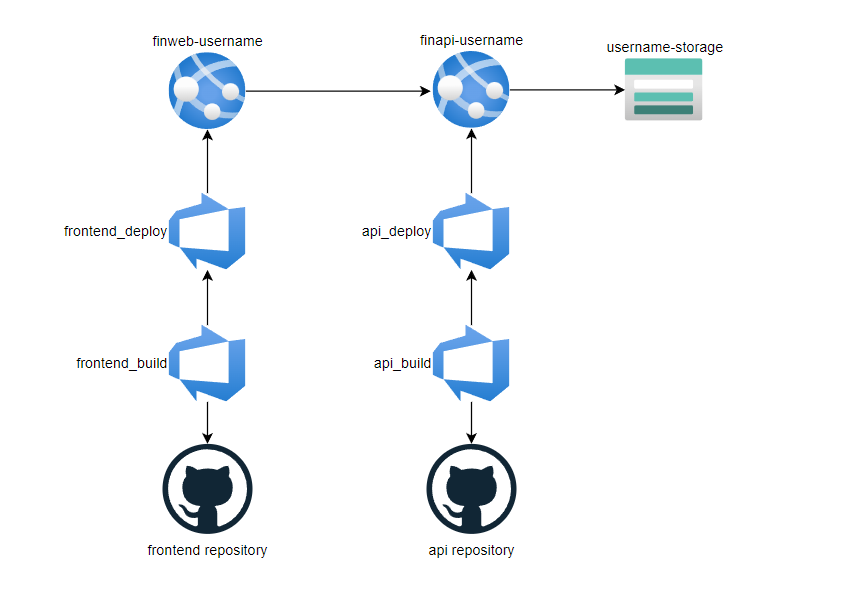
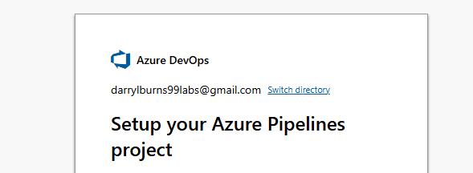
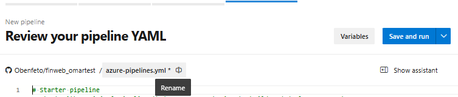
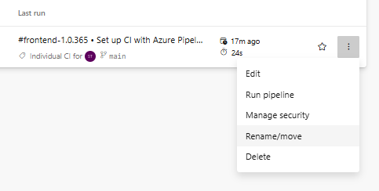

# Lab 04 : Deploy with Github Action and Azure Devops Pipelines

## Lab introduction

In this lab, you will perform changes on the Web Frontend and the API. You will be using Deployments through GitHub Actions, and then switch your CI/CD pipeline to the Azure DevOps platform.

This lab requires an Azure subscription. Your subscription type may affect the availability of features in this lab. You may change the region, but the steps are written using the East US region.

## Estimated timing: 50 minutes

## Lab Scenario

In this lab, you will explore release process & engineering

## Job skills

+ Task 1: Deploying with GitHub Action
+ Task 2: Deploying with Azure Devops

## Azure Web Application Architecture Diagram




## Instructions

### Before you start

#### Sign in to the lab environment

Sign in to your Windows 11 virtual machine (VM).

> **Note**: Your instructor will provide instructions to connect to the virtual lab environment.


## Task 1: Deploy a new api endpoint with github action

### Frontend 

1. Connect to your Windows VM
1. Navigate to your local git frontend repository
1. Edit the file app.py
    > **Note**: If you edit using vi, make sure to use `set number` command to view the file line numbers
1. Go to line 80, then insert the code provided below.
1. Save the file

    ```
    
    @app.route('/slow-endpoint')
    def slow_endpoint():
        if 'user' not in session:
            return redirect(url_for('login'))
    
        try:
            response = requests.get(f"{BACKEND_API_BASE}/api/slow-endpoint")
            result = response.json()
        except Exception as e:
            result = {"error": str(e)}
    
        return result
    
    ```
    1. Push your changes :
    ```
    git add --all
    git commit -m "new service"
    git push
    
    ```
1. Open a browser and browse to your GitHub repository
1. Click the Actions page, and you should see a deployment being triggered

### API 

1. Navigate to your local git api repository
1. edit the file application.py
    > **Note**: If you edit using vi, make sure to use `set number` command to view the file line numbers
1. Go to bottom of the file, then copy the code provided below
    ```
    @app.route('/api/slow-endpoint')
    def slow_endpoint():
        time.sleep(5)
        return "This was a slow response after 5 seconds"
    
    ```
1. Go to the top of the file, add the line below
    ```
    import time
    ```
1. Push your changes :
    ```
    git add --all
    git commit -m "new service"
    git push
    ```
1. Open a browser and browse for your github repository

1. click the Actions page, you should see a deployment being triggered

1. After the deployment is complete, check the endpoint is working

## Task 2 : Deploying complex pipelines with Azure Devops

### Remove the previous configuration 

1. Navigate to your finweb app through the Azure portal

1. Go to Settings > Configuration, and remove the startup command
    > **Note**: Deploying with Azure DevOps will enable a better startup component

1. Go to the Deployment Center, and click Disconnect. Accept the message when prompted

1. Execute the following command, replacing with your student number

    ```
    curl -i "https://finweb-student099.azurewebsites.net/"
    ```

    

1. Repeat these steps for your finapi


### Set up our pipelines in Azure Devops

#### Generate a token for devops pipeline

1. Navigate to **https://dev.azure.com/opscosolutions** and select your project Training-Student-xxx
   
1. Click the **User Setting** at the top right of your screen. Then **Personal Access Tokens**
   
1. Click new token
   
1. Choose the name of your choice and select full access
   
1. Click Create and **save the token**, we will use this value later.   


#### Frontend Package Building 

1. Navigate to **https://dev.azure.com/opscosolutions** and select your project Training-Student-xxx
   
1. Navigate to Pipelines > Create Pipeline
   
1. Where is your code ? Choose Github
   
1. Here you will need to authorize Azure Devops by login to your github account
   
1. When done, Select your frontend repository

   > **Note:** If a connection window "Setupe you Azure Pipelines project" opens, click on top on **Switch directory** and select "OPSCO Solutions"
   > 
   > 

1. In the Configure Your Pipeline step choose Starter Pipeline

1. Rename your pipeline file from "azure-pipelines.yml" to **finweb_yourname_build**
   
   

1. Here copy the code from the labs repository : /Allfiles/Labs/04/Pipelines/Web/frontend_build.yml
   
1. Save and run, then Create
   
1. Click on the job to access the logs
   
1. You can see the different steps and their results. click on Job and look at the logs. click the "1 artifact" link.
   
1. Check that the artifact contain all our expected files
   
1. Navigate to Pipelines, select the 3 dots options on the right side of the line of the pipeline. Select Rename, and input **finweb_yourname_build**
   
   


#### Frontend Package Deploy

1. Navigate to **https://dev.azure.com/opscosolutions** and select your project Training-Student-xxx
   
1. Navigate to Pipelines > New Pipeline
   
1. Where is your code ? Github
   
1. Select your frontend repository
   
1. In the Configure Your Pipeline step choose Starter Pipeline

1. Rename your pipeline file from "azure-pipelines.yml" to **finweb_yourname_deploy.yml**
   
   
1. Here copy the code from the lab repository : /AllFiles/Labs/04/Web/Pipeline/frontend_deploy.yml
   
1. Replace the place holders in the file:
   - <<< YOUR AZURE DEVOPS PROJECT >>> should be configured like **Training-Student-0xx**
   - <<< YOUR BUID PIPELINE >>> should be configured like **finweb_yourname_build**
   - <<< YOUR RESSOURCE GROUP >>> should be configured like **Training-Student-0xx**
   - <<< YOUR WEB APP >>> should be configured like **finweb-yourname**
   
1. Click on Variables, add a new one
   
1. Name it MY_DEVOPS_PAT and copy the token you saved earlier in the value, then **OK** and **Save**
   
1. Save and run, then Create
   
1. Click on the job to access the logs

1. Navigate to Pipelines, select the 3 dots options on the right side of the line of the pipeline. Select Rename, and input **finweb_yourname_deploy**

1. In Azure, you should be able to see a new deployment on your front end app, check the log stream

#### API Package Build

1. Navigate to **https://dev.azure.com/opscosolutions** and select your project Training-Student-xxx
   
1. Navigate to Pipelines > New Pipeline
   
1. Where is your code ? Choose Github
   
1. Here you will need to authorize Azure Devops by login to your github account
   
1. When done, Select your api repository
   
1. In the Configure Your Pipeline step choose Starter Pipeline
   
1. Rename your pipeline file from "azure-pipelines.yml" to **finapi_yourname_build**
   
   
   
1. Here copy the code from the lab repository : Allfiles/Labs/04/Pipelines/Web/api_build.yml
   
1. Save and run, then Create

1. Navigate to Pipelines, select the 3 dots options on the right side of the line of the pipeline. Select Rename, and input **finapi_yourname_build**

1. Click on the job to access the logs
   
1. You can see the different steps and their results. click on Job and look at the logs. click the "1 artifact" link.

1. Check the artifact content it should be our 2 files

#### API Package Deploy

1. Navigate to **https://dev.azure.com/opscosolutions** and select your project Training-Student-xxx
   
1. Navigate to Pipelines > New Pipeline
   
1. Where is your code ? Github
   
1. Select your api repository
   
1. In the Configure Your Pipeline step choose Starter Pipeline

1. Rename your pipeline file from "azure-pipelines.yml" to **finapi_yourname_deploy.yml**
   
   
   
1. Here copy the code from the lab repository : /AllFiles/Labs/04/API/Pipeline/api_deploy.yml
   
1. Replace the place holders in the file:
   - <<< YOUR AZURE DEVOPS PROJECT >>> should be configured like **Training-Student-0xx**
   - <<< YOUR BUID PIPELINE >>> should be configured like **finapi_yourname_build**
   - <<< YOUR RESSOURCE GROUP >>> should be configured like **Training-Student-0xx**
   - <<< YOUR API APP >>> should be configured like **finapi-yourname**
   
1. Click on Variables, add a new one
   
1. Name it MY_DEVOPS_PAT and copy your token in the value
   
1. Save and run, then Create

1. Navigate to Pipelines, select the 3 dots options on the right side of the line of the pipeline. Select Rename, and input **finapi_yourname_deploy**
   
1. Click on the job to access the logs

1. After 5 minutes check that the deployment was done successfully and the api is properly working.


---

## Key takeaways

Congratulations on completing the lab. Here are the key takeaways from this lab.
+ GitHub Actions and Azure DevOps pipelines enable reliable CI/CD workflows across your frontend and API services.
+ Automated deployments reduce manual steps and ensure consistent release processes.
+ Integrating both platforms prepares you for real-world DevOps flexibility in tooling.
+ Deploying new endpoints through version control triggers traceable, testable deployments.
+ Artifact packaging separates build and deploy concerns, improving pipeline clarity.
+ Using PAT tokens securely connects your Azure DevOps pipelines to deployment targets.

