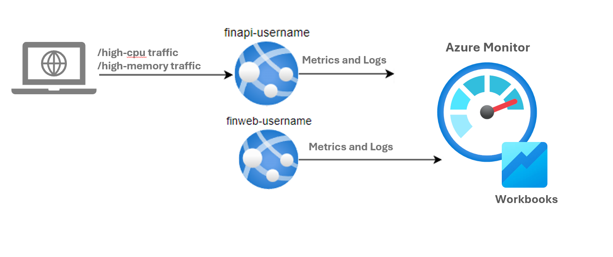

# Lab 05 - Troubleshooting & Pipeline Monitoring

## Lab introduction

In this lab, you will troubleshoot incidents, and use your technical skills to identify the rootcause of the issue, and how to detect it earlier or correct it on a long term.

This lab requires an Azure subscription. Your subscription type may affect the availability of features in this lab. You may change the region, but the steps are written using **East US**.

## Estimated timing: 50 minutes

## Lab Scenario

In this lab, you will explore issues on our pipeline and about performance issues on our Api Web Application. Our users have faced slownesses during peak hours when using some screens.  
You are in charge of delivering the changes on your finweb and finapi using your Azure Devops Pipeline.
You will then troubleshoot the issues along the way and 
You will need to read the symptoms provided by the users and analyze the performance of your finapi.

## Job skills

+ Task 1: Deliver two new endpoints using azure devops pipeline
+ Task 2: Troubleshoot Pipeline issues
+ Task 3: Troubleshoot API
+ Task 4: Pipeline Monitoring


## Azure Web Application Architecture Diagram




## Instructions

### Before you start

#### Sign in to the lab environment

Sign in to your Windows 11 virtual machine (VM).

> **Note**: Your instructor will provide instructions to connect to the virtual lab environment.

## Task 1 Setup Log Analytics for finweb and finapi


### Feed our Log Analytics Workspace from our apps

1. In the Azure portal, use the **Search resources, services, and docs** text box to search for **Log Analytics workspaces**, and select **+ Create**

1. Select your ressource group, enter **log-analytics-workspace** as the Name
   
1. Select **Review + Create**, then **Create**
   
   > **Note**: Now you have a centralized log analytics workspace. We will now feed it with Metrics & Logs from your finweb and finapi.
   
1. In Azure portal, navigate to your api application **finapi-yourname**

1. Navigate to Monitoring > Application Insight
   
1. Select **Turn on Application Insights** to enable it

1. Now create a new log analytics ressource as follow:
   - New resource name: **finapi-yourname-analytics**
   - Log Analytics Workspace: Select the log analytics workspace you created previously (**log-analytics-workspace**)

1. Select **Apply**, then **Yes**

1. Now go to Monitoring > Diagnostic Settings

1. Select **+ Add diagnotic setting**

1. In the new page select : HTTP Logs, App Service Console Logs , App Service Application Logs , Access Audit Logs and AllMetrics

1. Enter **finapi-diagnostic** as the "Diagnostic setting name"

1. Check also **Send to Log Analytics Workspace for the Destination**, and select your Log Analytics workspace, then hit save.

   > **Note**: It will take up to 10 minutes for logs to flow properly into your log analytics workspace

1.  Follow the same steps 4-13 for finweb this time.


### Generate traffic and check the Metrics & Logs are available

1. In your Visual Studio, open a terminal and run the below commands :

   ```
   # Front end Traffic
   curl -i "https://finweb-yourname.azurewebsites.net/"
   curl -i "https://finweb-yourname.azurewebsites.net/dashboard"

   # Api Traffic
   curl -i "https://finapi-yourname.azurewebsites.net/"
   curl -i "https://finapi-yourname.azurewebsites.net/api/retrieve-price?symbol=AAPL"
   curl -i "https://finapi-yourname.azurewebsites.net/api/list-reports"
   curl -i "https://finapi-yourname.azurewebsites.net/api/slow-endpoint"
   ```

1. In Azure Portal, navigate to your Log Analytics workspace (**log-analytics-workspace**)

1. Select **Logs**

1. A new page will popup, this is the query hub which contain all the built-in queries available. Close the page

1. Close the popup, and on the top right of the query page, change from **Simple Mode** to **KQL Mode**

1. Run the query below to check the CPU usage for both your applications

   ```
   AzureMetrics
   | where Resource contains "FINWEB-yourname" or Resource contains "FINAPI-yourname"
   | where MetricName == "CpuTime"
   | summarize AvgCpuTime = avg(Total) by bin(TimeGenerated, 5m), Resource
   | order by TimeGenerated desc
   ```
   > **Note**: Replace "yourname" to target your web and api applications
   
1. If you were not able to run the query above, it might be due to delay between the activation of the log flow between your Application Insights, and your Analytics Workspace.

1. If you are in this case, you can check separatly your Web and Api **Application Insights** metrics

1. For example, in the Azure portal use the **Search resources, services, and docs** text box to search for **Application Insights**, and press Enter
  
1. Select your api Application Insights **(finapi-yourname)**

1. Select Monitoring > Logs

1. A new page might popup, this is the query hub which contain all the built-in queries available. Close the page

1. Close the popup, and on the top right of the query page, change from **Simple Mode** to **KQL Mode** and run the following
   ```
   requests
   | where timestamp > ago(30m)
   | project name, url, resultCode, duration, success
   
   ```
   > **Note**: This should return the requests made on finapi. Navigate to your finweb **Application Insights** if you are looking for the requests made to finweb.


## Task 2: Deploy two new endpoints using azure devops pipeline

1. In Visual Studio, go to GitBash, and move to your finapi local git repository (finapi_yourname)
1. Add the code below to any @app.route section in `application.py`

   ```
   @app.route('/high-cpu')
   def high_cpu():
       # Simulate CPU load by calculating primes
       n = 50000
       primes = []
       for num in range(2, n):
           is_prime = True
           for i in range(2, int(math.sqrt(num)) + 1):
               if num % i == 0:
                   is_prime = False
                   break
           if is_prime:
               primes.append(num)
       return f"Calculated {len(primes)} prime numbers."
   
   @app.route('/high-memory')
   def high_memory():
       # Simulate memory load
       data = ['x' * 1024 * 1024] * 500  # ~500MB in-memory array
       time.sleep(5)
       return f"Allocated {len(data)} MB of memory temporarily."
   ```
1. Push the code to your repository
   ```
   git add --all
   git commit -m "delivering two new endpoints"
   git push
   ```

1. Your build pipeline should trigger automatically, check this in azure devops
   
1. If you build pipeline finished successfuly, trigger your api deploy pipeline

1. Go back to Visual Studio, in your git bash and run the below command
   ```
   curl https://<your-api-app>.azurewebsites.net/high-cpu &
   curl https://<your-api-app>.azurewebsites.net/high-memory &
   ```
1. The first command should throw an error due to high CPU usage , the second one should return the memory allowed for each call
   
1. If the command were not successfull, you can investigate the logs in Azure on your Web App **finapi-yourname**
   > **Note:** Select **Log Stream** to read the error message in the logs 


## Task 3 : Create workbook for future Troubleshooting with Log Analytics 

1. Go to your Log Analytics Workspace (**log-analytics-workspace**) in azure portal

1. Navigate to Monitoring > Workbooks

1. Create a new Workbook
   
   > **Note**: Azure provide Built-In Workbook that gives access to several information on the ressource, here our log analytics workspace

1. You land on a page with a query editor for KQL. Use the code below to build the visuals and follow these steps for each query :

1. Copy the code, hit the Run Query.

1. Go in Advanced Setting and change **step name** and **Chart Title** using the query section title (i.e View All Logs (Last 1 Hour))

1. When done with one query, hit the add button at the bottom of your screen, and choose **Query**

1. (Optional) : Use the Visualisation menu, select a visual representation of the data when relevant.
   - View All Logs (Last 1 Hour)
   ```
   AppServiceHTTPLogs
   | where TimeGenerated > ago(1h)
   | project TimeGenerated, CsMethod, CsUsername, CsUriStem, CsHost, ScStatus, TimeTaken, UserAgent
   | order by TimeGenerated desc 
   ```
   - Count by HTTP Status Codes (Last 1 Hour)
   ```
   AppServiceHTTPLogs
   | summarize Count = count() by ScStatus
   | order by Count desc 
   ```
   - Average Time Taken per URI
   ```
   AppServiceHTTPLogs
   | summarize AvgTimeTaken = avg(TimeTaken) by CsUriStem
   | order by AvgTimeTaken desc  
   ```
   - Failed Requests (Status 400 or 500+)
   ```
   AppServiceHTTPLogs
   | where ScStatus >= 400
   | project TimeGenerated, CsMethod, CsUriStem, CsHost, ScStatus, TimeTaken
   | order by TimeGenerated desc
   ```
   - Requests by Username   
   ```
   AppServiceHTTPLogs
   | where isnotempty(CsUsername)
   | summarize RequestCount = count() by CsUsername
   | order by RequestCount desc 
   ```

1. When you are done with all the queries and the  Visualizations click Done Editing on the top right.

1. Generate traffic again 

---

## Key takeaways

Congratulations on completing the lab. Here are the key takeaways from this lab.

+ Azure Log Analytics enables centralized visibility into performance, usage, and failures across your app services.
+ Application Insights and diagnostic settings are key for collecting detailed telemetry and logs.
+ High CPU or memory usage can be simulated to reproduce and diagnose production-like issues.
+ Visual workbooks help create structured dashboards for faster issue investigation.
+ Structured logging and KQL queries allow proactive alerting and informed debugging.
