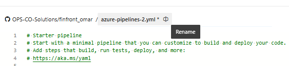
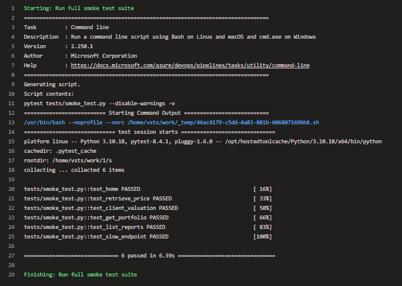
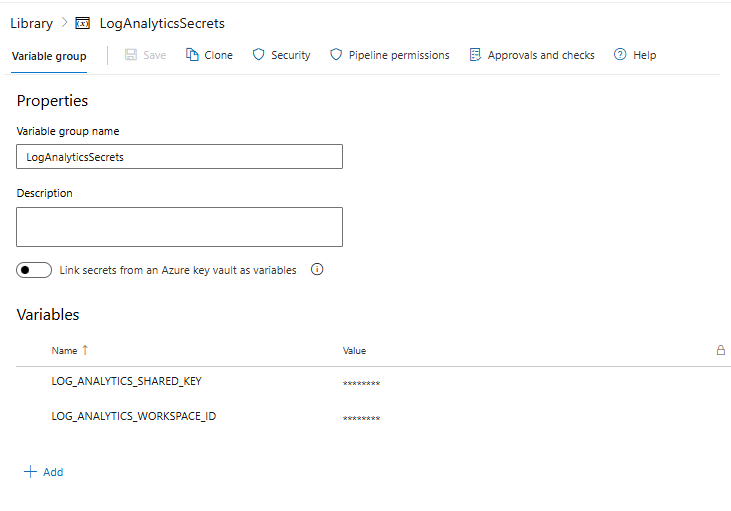
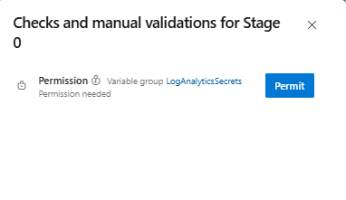
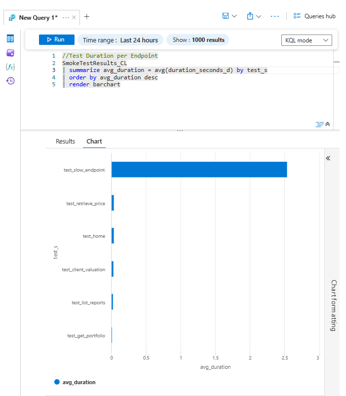
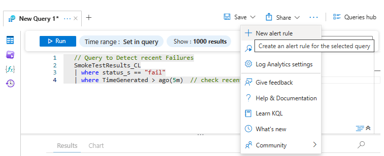
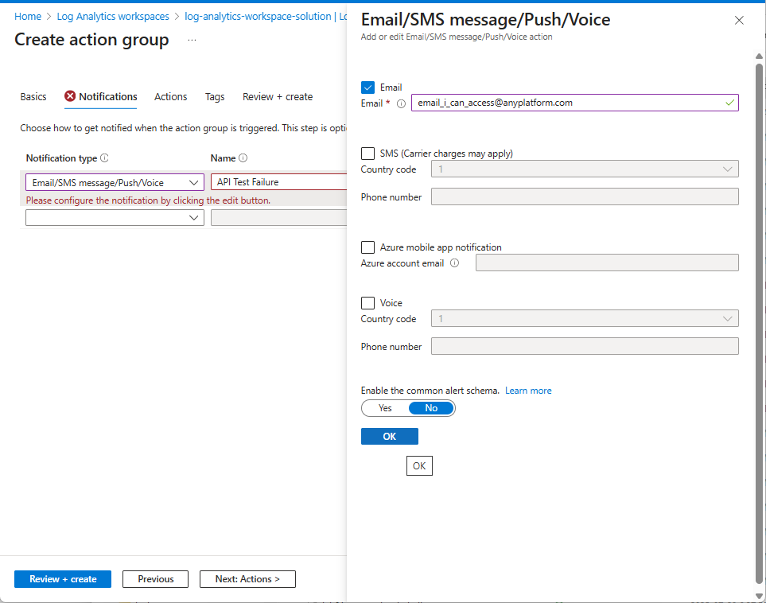
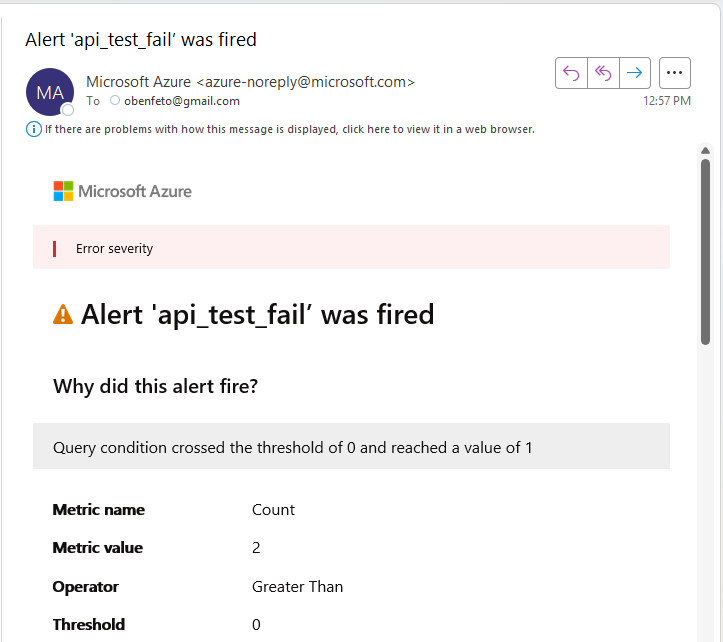
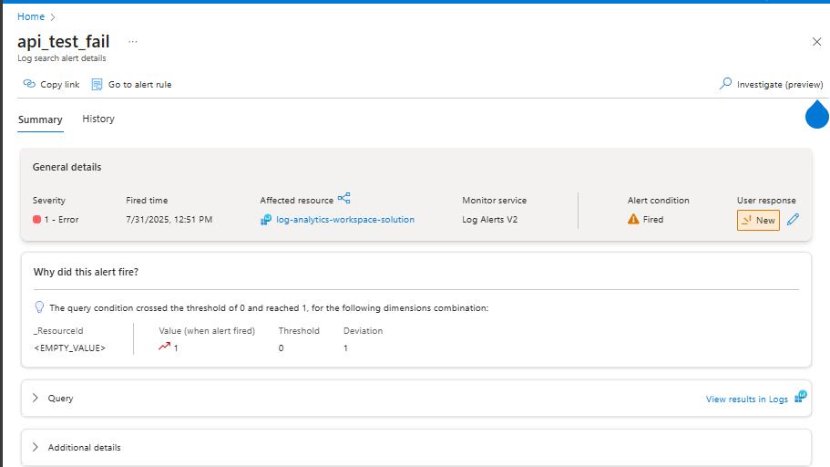
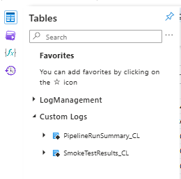

# Lab 06 - Implementing testing with Azure Devops 

## Lab introduction

In this lab, you’ll build a pipeline to test deployment artifacts and add automated API checks with metrics sent to Log Analytics.

This lab requires an Azure subscription. Your subscription type may affect the availability of features in this lab. You may change the region, but the steps are written using **East US**.

## Estimated timing: 50 minutes

## Lab Scenario

In this lab, you will build a pipeline to test that the artifacts are correctly built and available for deploying.
We will then implement automated post-release check through a pipeline to test that our API endpoints are properly deployed and available for our users. 


## Job skills

+ Task 1: Implement a Post-Deployment Testing Pipeline
+ Task 2: Send API testing metrics to Azure Log Analytics
+ Task 3: Setup metrics visualizations and alerts
+ Task 4: Send all API Pipelines metrics to Azure Log Analytics

## Instructions

### Before you start

#### Sign in to the lab environment

Sign in to your Windows 11 virtual machine (VM).

> **Note**: Your instructor will provide instructions to connect to the virtual lab environment.


## Task 1: Implement a Post-Deployment Testing Pipeline in Azure Devops

### Set up your Testing pipeline in Azure Devops

1. Navigate to your local git api repository
1. Create a folder **tests** in your api repository
1. Inside the **tests/** folder, create the file **smoke_tests.py**
1. Here, copy the code from the lab repository : /AllFiles/Labs/06/Pipelines/API/smoke_tests.py
1. Replace "https://finapi-yourname.azurewebsites.net" by your api url
1. Push your changes :
   ```
   git add --all
   git commit -m "new service"
   git push
   ```

1. Navigate to **https://dev.azure.com/opscosolutions** and select your project Training-Student-0xx-OC0xx
1. Navigate to Pipelines > Create new Pipeline   
1. Where is your code ? Github
1. Select your api repository 
1. In the Configure Your Pipeline step choose Starter Pipeline
1. Rename your pipeline from "azure-pipelines.yml" to **finapi_yourname_smoke_tests.yml**
   
   
1. Here copy the following code :
   ```yaml
   trigger: none
   
   pool:
     name: student-lab-pool
   
   steps:
     - script: |
         /azagent/venv/bin/pip3 install pytest requests
       displayName: "Install dependencies"
   
     - script: |
         /azagent/venv/bin/python3 -m pytest -v --tb=line  -W "ignore::DeprecationWarning" -s tests/smoke_tests.py --junitxml=smoke-results.xml
       displayName: "Run full smoke test suite"
   
   
     - task: PublishTestResults@2
       condition: always()
       inputs:
         testResultsFiles: 'smoke-results.xml'
         testRunTitle: 'Post-deployment Smoke Test'
         failTaskOnFailedTests: false
   ```
   
1. Save and run  
1. Click on the job to access the logs, observe how many tests passed and the error in the logs of the task **Run full smoke test suite**   
   > **Note**: By investigating the log message you should identify the root-cause: a timeout error.


### Fine tune your tests

> **Note**: We know that **slow-endpoint** takes at least 5 seconds to run. Let's take this into account in our test.

1. Navigate to your local git api repository
1. Edit the file smoke_test.py
1. Modify the timeout of the test **slow-endpoint** test, from 5 seconds to 10 seconds
   ```
   def test_slow_endpoint():
       r = requests.get(f"{BASE_URL}/api/slow-endpoint", timeout=10)
       assert r.status_code == 200
   ```

1. Push your changes :
   ```
   git add --all
   git commit -m "new service"
   git push
   ```

1. Navigate to **https://dev.azure.com/opscosolutions** and select your project Training-Student-0xx-OC0xx
1. Navigate to Pipelines > **finapi_yourname_smoke_test** then select **Run pipeline**.
1. Click on the job to access the logs, observe the logs of the task **Run full smoke test suite**
    
   > **Note**: All the tests should be passing now.


### Automate the test pipeline to run after each deployment

1. Navigate to **https://dev.azure.com/opscosolutions** and select your project Training-Student-0xx-OC0xx
1. Navigate to Pipelines > **finapi_yourname_smoke_test** then **Edit**
1. Replace line 1 "trigger: none" by the following, and replace "yourname":
   ```
   trigger: none
   
   resources:
     pipelines:
       - pipeline: buildPipeline
         source: finapi_yourname_deploy
         trigger:
           branches:
             include:
               - main
   ```

## Task 2: Send API testing metrics to your centralized Azure Log Analytics

### Setup the connection between Azure DevOps and your log analytics workspace 

1. Navigate to Azure, In the top search bar, type "Log Analytics workspaces" and open it.
1. Click on the Log Analytics Workspace you're using **log-analytics-workspace**
1. Select Settings > Agents, then expand "Log Analytics agent instructions"
1. Copy and save in a note the values of "Workspace ID" and "Primary key"
   > **Note**: We will use these credentials to push metrics data to Azure Log Analytics from outside Azure.

1. Navigate to **https://dev.azure.com/opscosolutions** and select your project Training-Student-0xx-OC0xx
1. Select Pipelines > Library, then **+ Variable group**
1. Create the Variable Group with name **LogAnalyticsSecrets**
1. Under Variables, select **+ Add** 
   - Name: LOG_ANALYTICS_WORKSPACE_ID
      - Value: Saved in previous step
   - Name: LOG_ANALYTICS_SHARED_KEY
      - Value: Saved in previous step

1. For each variable line, click on the lock icon "Change variable type to secret". Then **Save**




### Link the Variable Group in your API smoke test pipeline

1. Navigate to **https://dev.azure.com/opscosolutions** and select your project Training-Student-0xx-OC0xx
1. Navigate to Pipelines > **finapi_yourname_smoke_test** then **Edit**
1. Insert the following **before** the line 12 that contains "pool:"
   ```
   variables:
     - group: LogAnalyticsSecrets
   
   ```

1. Replace the line that contains "/azagent/venv/bin/python3 -m pytest -v --tb=line  -W "ignore::DeprecationWarning" -s tests/smoke_tests.py --junitxml=smoke-results.xml" by the following:
   ```
   export LOG_ANALYTICS_WORKSPACE_ID=$(LOG_ANALYTICS_WORKSPACE_ID)
   export LOG_ANALYTICS_SHARED_KEY=$(LOG_ANALYTICS_SHARED_KEY)
   /azagent/venv/bin/python3 -m pytest -v --tb=line  -W "ignore::DeprecationWarning" -s tests/smoke_tests_centralized_tests.py --junitxml=smoke-results.xml
   ```
   
1. Save

### Implement the sending of the testing results to Azure Log Analytics

1. Navigate to your local git api repository
1. In the folder **tests**, create the file **log_analytics.py**
1. Here, copy the code from the lab repository : /AllFiles/Labs/06/Pipelines/API/log_analytics.py
1. Observe the function "send_log_to_loganalytics()", notice the usage of "workspace_id" and "shared_key"
1. In the folder **tests**, create the file **smoke_tests_centralized.py**
1. Here, copy the code from the lab repository : /AllFiles/Labs/06/Pipelines/API/smoke_tests_centralized.py
1. Replace "https://finapi-yourname.azurewebsites.net" by your api url
1. Observe the new functions in "smoke_tests_centralized.py", notice the differences with "smoke_tests.py"
1. Take particular attention to the function "test_send_logs_to_log_analytics()"
1. Push your changes
   ```
   git add --all
   git commit -m "new service"
   git push
   ```
   > **Note:** Make sure your pipelines run in this order: build -> deploy -> smoke tests.

1. You should see the message "This pipeline needs permission to access a resource before this run can continue". Click View, then **Permit**
   


## Task 3: Setup metrics visualizations and alerts

1. Navigate to Azure, In the top search bar, type "Log Analytics workspaces" and open it.
1. Click on the Log Analytics Workspace you're using **log-analytics-workspace**
1. Select **Logs**, then change from "Simple Mode" to **KQL mode**
1. Enter the following query and **Run**:
   ```
   //Test Duration per Endpoint
   SmokeTestResults_CL
   | summarize avg_duration = avg(duration_seconds_d) by test_s
   | order by avg_duration desc
   | render barchart
   ```
   

1. Select **+ Add a new Tab**, enter the following and **Run**:
   ```
   // Failures per Test (Total Count)
   SmokeTestResults_CL
   | where status_s == "fail"
   | summarize Failures = count() by test_s
   | order by Failures desc
   ```

1. Select **+ Add a new Tab**, enter the following and **Run**:
   ```
   // Stacked Bar Chart by Status Code and Test Name
   SmokeTestResults_CL
   | summarize Count = count() by tostring(status_code_d), test_s
   | render columnchart kind=stacked
   ```

### Create an Alert on Fail test

1. Select **+ Add a new Tab**, enter the following and **Run**:
   ```
   // Query to Detect recent Failures
   SmokeTestResults_CL
   | where status_s == "fail"
   | where TimeGenerated > ago(5m)  // check recent 5 minutes
   ```

1. At the top of the Logs screen, click "New alert rule".

   

1. Under “Alert logic” (scroll down), select:
   - Operator: greater than
   - Threshold value: 0
   - Frequency of evaluation: 5 minutes

   > **Notes:** This means any failures that happen in the last 5 min, triggers the alert.

1. Select **Next:Actions**, click on **+ Create action group** and Enter the following:
   - Action group name: api_test_fail
   - Display name: api_fail
   - Email: <youremail>

   

1. Select **Next:Notifications**, and enter the following:
   - Notification type: Email/SMS message/Push/Voice
   - Name: "API Test Failure"
   - Email: any email adress you can access

1. Select **Review+Create**, then **Create**

   > **Notes:** With this step you created the action group that will send an alert email to the sre team (you).
     
1. Select **Next:Details**, and enter the following:
   - Severity: "1 - Error"
   - Alert rule name: api_test_fail

1. Select **Review+Create**, then **Create**

   > **Notes:** Congrats, with this step you created the alert rule that will trigger the action group.
   
### Test Alert Notification trigger

1. Navigate to your local git api repository
1. Modify the file **smoke_tests_centralized.py**. Replace "response = requests.request(method, url, timeout=10)" with the following:
   ```
   response = requests.request(method, url, timeout=5)
   ```
   > **Notes:** With this change we make sure the test_slow_endpoint will fail.

1. Push your changes
   ```
   git add --all
   git commit -m "new service"
   git push
   ```

1. Navigate to Pipelines > **finapi_yourname_smoke_test** then select **Run pipeline**.
   
   > **Notes:** The smoke test will fail and you will receive an alert notification email triggered by the failed test.

1. Confirm you received the alert email in your mailbox and open it.
   
   
   
1. Scroll down and click on **View alert details**

   

   > **Notes:** Congrats, this will be the entry point for sre team to investigate the api test failure.


## Task 4: Send all API Pipeline run metrics to your centralized Azure Log Analytics

1. Navigate to **https://dev.azure.com/opscosolutions** and select your project Training-Student-0xx-OC0xx
1. Navigate to Pipelines > **finapi_yourname_smoke_test** then **Edit**
1. Replace the line "steps:" by the following:
   ```
   steps:
   - script: |
         echo "##vso[task.setvariable variable=PIPELINE_START_TIME]$(date +%s.%3N)"
         echo "##vso[task.setvariable variable=PIPELINE_START_TIME_UTC]$(date -u +%Y-%m-%dT%H:%M:%SZ)"
     displayName: "Capture pipeline start time"
   
   ```

1. At the end of the file, add the following:
   ```
     - script: |
         export LOG_ANALYTICS_WORKSPACE_ID=$(LOG_ANALYTICS_WORKSPACE_ID)
         export LOG_ANALYTICS_SHARED_KEY=$(LOG_ANALYTICS_SHARED_KEY)
         export PIPELINE_NAME=$(Build.DefinitionName)
         export RUN_ID=$(Build.BuildId)
         export BUILD_STATUS=$(Agent.JobStatus)
   
         END_TIME=$(date +%s.%3N)
         export PIPELINE_END_TIME_UTC=$(date -u +%Y-%m-%dT%H:%M:%SZ)
         export PIPELINE_DURATION=$(awk "BEGIN {print $END_TIME - $(PIPELINE_START_TIME)}")
         echo "Duration is $PIPELINE_DURATION seconds"
         echo "PIPELINE_END_TIME_UTC is $PIPELINE_END_TIME_UTC"
         echo "PIPELINE_START_TIME_UTC is $PIPELINE_START_TIME_UTC"
   
         /azagent/venv/bin/python3 -c "
         import os
         import time
         from tests.log_analytics import send_log_to_loganalytics
   
         pipeline_data = [{
             'pipeline': os.environ.get('PIPELINE_NAME'),
             'run_id': os.environ.get('RUN_ID'),
             'status': os.environ.get('BUILD_STATUS'),
             'start_time': os.environ.get('PIPELINE_START_TIME_UTC'),
             'end_time': os.environ.get('PIPELINE_END_TIME_UTC'),
             'duration_seconds': float(os.environ.get('PIPELINE_DURATION') or 0)
         }]
   
         send_log_to_loganalytics(
             log_type='PipelineRunSummary',
             log_data=pipeline_data
         )"
       condition: always()
       displayName: "Send pipeline run metadata to Log Analytics"
   ```

1. Select **Validate and Save**, then **Run**
1. Check the logs of the pipeline's step **Send pipeline run metadata to Log Analytics**, it should end with the following:
   ```
   ✅ Logs sent to Log Analytics.
   ```
1. Do the same for the pipelines **finapi_yourname_build** and **finapi_yourname_deploy**
   > **Notes:** Additional step, link the "LogAnalyticsSecrets" variable
   
   > **Notes:** Insert the following **after** the line that contains "variables:"
   > ```
   >   - group: LogAnalyticsSecrets
   >
   > ```
1. Select **Validate and Save**
   
1. Then in **smoke_tests_centralized.py**, replace the line "response = requests.request(method, url, timeout=5)" with the following:
   ```
   response = requests.request(method, url, timeout=10)
   ```
1. Push your changes
   > **Notes:** The 3 api pipelines will run and trigger in cascade (build -> deploy -> post-release test) 
1. Navigate to Azure, In the top search bar, type "Log Analytics workspaces" and open it.
1. Click on the Log Analytics Workspace you're using **log-analytics-workspace**
1. Select **Logs**, then **Tables**, and expand **Custom Logs**.
1. You should now see **PipelineRunSummary_CL** in addtion of **SmokeTestResults_CL**
   
   
   
1. Explore the latest pipeline runs data, run the following:
   ```
   // Average duration per pipeline
   PipelineRunSummary_CL
   | summarize avg(duration_seconds_d) by pipeline_s
   | render barchart 
   ```
   
   ```
   // number of failed pipelines in the last 30 minutes
   PipelineRunSummary_CL
   | where TimeGenerated > ago(30m)
   | where status_s != "Succeeded"
   | summarize FailureCount = count()
   ```

---

## Key takeaways

Congratulations on completing the lab. Here are the key takeaways from this lab.

+ Post-deployment testing helps validate that your APIs are reachable and functioning after a release, reducing production risk.
+ Azure DevOps pipelines allow you to automate both build validation and smoke test execution across environments.
+ Smoke test results can be sent to Azure Log Analytics, enabling centralized observability and trend analysis across releases.
+ You can push structured test results to Azure Log Analytics, enabling centralized tracking of test status, duration, and HTTP response metrics across all environments.
+ Azure Monitor and Log Analytics work together to provide actionable insights from test logs, including failures and performance metrics.
+ Alerts can be configured to notify your team immediately when a smoke test fails, improving your incident response time and system reliability.
